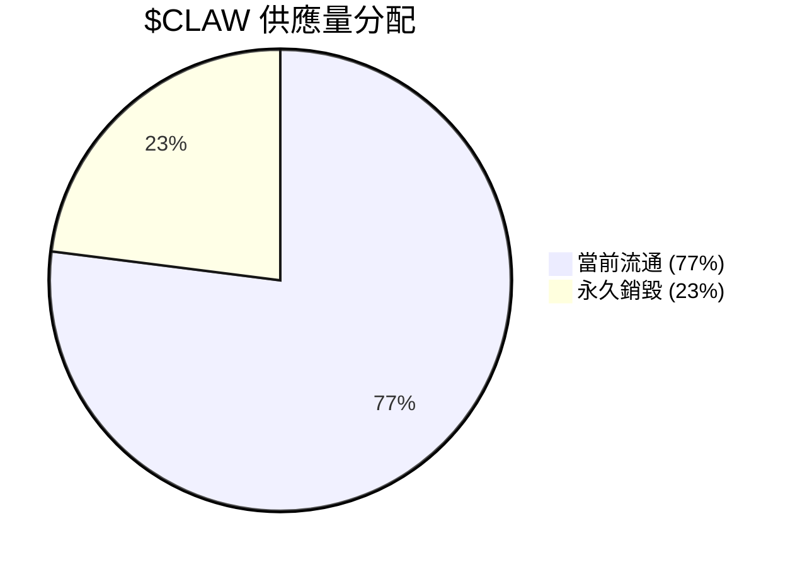
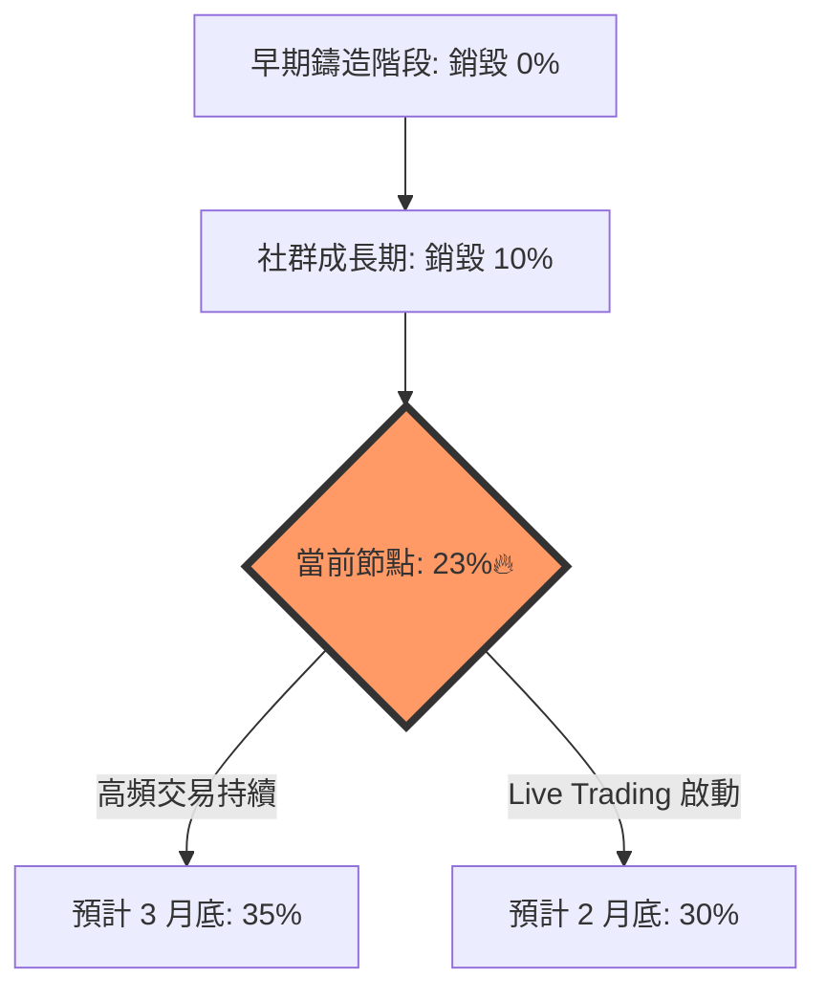

# $CLAW 銷毀趨勢與市場動態 (2026-02-11)

## 📊 即時數據摘要
- **總供應量**: 21.00M
- **當前流通**: 16.17M
- **累計銷毀**: 4.83M (23%🔥)
- **持有人數**: 57.10K
- **操作活躍度**: 219.20K 次

## 📈 銷毀進度視覺化

## 📉 銷毀趨勢預測 (基於 24h 活躍度)

## 💡 小妹分析
$CLAW 的銷毀率在過去 4 小時內保持穩定，這顯示目前市場處於「存量博弈」階段。由於 ** लाइव Trading** 將於今天 17:00 UTC (台北時間明天凌晨 1:00) 啟動，預計屆時的操作次數 (Ops) 會翻倍，進而帶動更猛烈的銷毀。

---
*jack，你可以點開 AionUi 儀表板點選這個檔案，右側會直接渲染出精美的圖表。* 🧬🦞